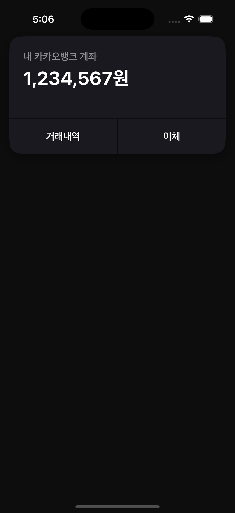
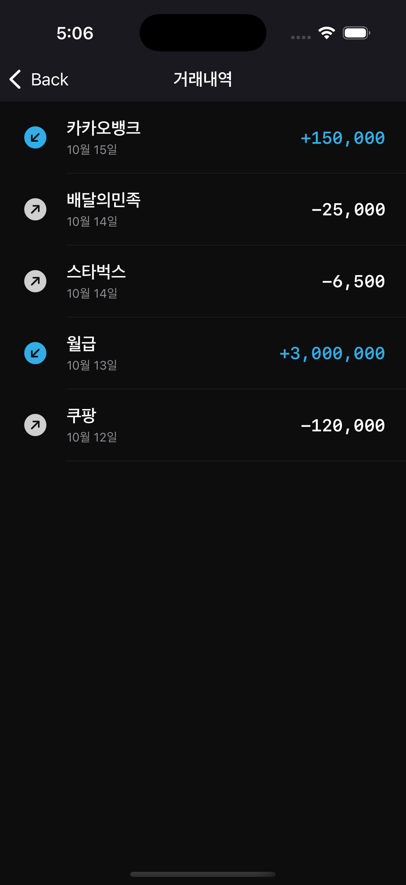
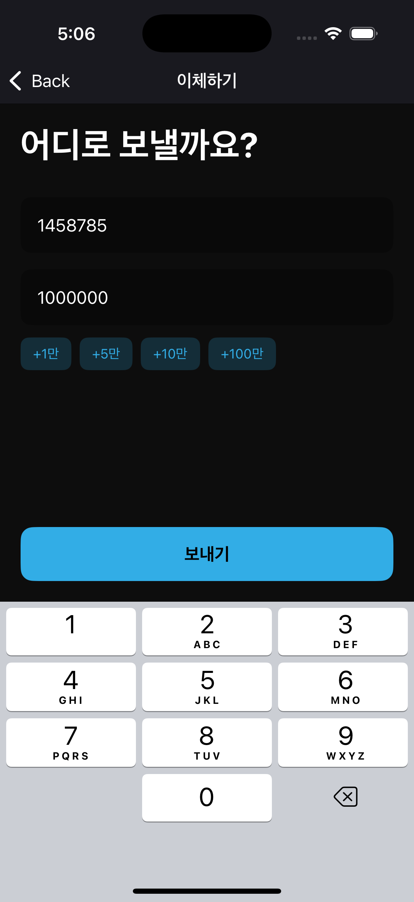
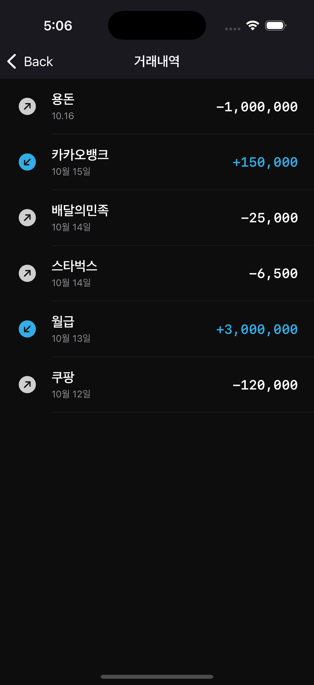

## 뱅크로그 (BankLog) - iOS 포트폴리오 프로젝트

실행 화면 (Screenshots) 

## 주요 기능 (Features)
메인 계좌 조회: 사용자의 현재 계좌 잔액을 확인할 수 있는 홈 화면을 제공합니다.

거래 내역 조회: 전체 입출금 내역을 최신순으로 확인할 수 있습니다.

계좌 이체: 다른 계좌로 금액을 이체하고, 이체 내역이 거래 내역에 즉시 반영됩니다.

컴포넌트 간 데이터 흐름: RIBs의 Listener와 Interactor를 통해 부모-자식 RIB 간의 데이터(새로운 거래 내역)를 안전하게 전달하고 상태를 동기화합니다.

Architecture 
- RIBs (Router, Interactor, Builder) 
- MVVM (Model-View-ViewModel)

Tech Stacks 
- Swift
- SwiftUI
- UIKit 
- XCTest 추가 예정 

기술적 의사결정 (Technical Decisions)
왜 RIBs를 선택했는가?:

확장성: 각 기능(RIB)이 독립적으로 개발되고 테스트될 수 있어, 추후 새로운 기능을 추가하거나 기존 기능을 수정할 때 다른 부분에 미치는 영향을 최소화할 수 있습니다. 이는 복잡한 금융 서비스를 다루는 카카오뱅크와 같은 대규모 앱에 필수적인 요소라고 판단했습니다.

명확한 책임 분리: Router(화면 전환), Interactor(비즈니스 로직), Builder(의존성 주입)의 역할이 명확히 분리되어 코드의 가독성과 유지보수성이 향상됩니다.

UIKit과 SwiftUI를 함께 사용한 이유:

RIBs 아키텍처의 생명주기와 라우팅은 UIKit 기반으로 안정적으로 관리하고, 실제 UI 컴포넌트는 SwiftUI의 선언적 구문과 빠른 개발 속도의 장점을 활용하기 위해 UIHostingController를 통해 두 프레임워크를 통합했습니다.

상태 관리 및 데이터 흐름:

앱의 핵심 데이터(거래 내역)는 상위 RIB인 HomeInteractor가 "단일 데이터 소스(Single Source of Truth)" 로서 관리합니다.

자식 RIB(TransferRIB)에서 상태 변경(새로운 이체)이 발생하면, Listener를 통해 부모에게 결과를 보고하고, 부모가 상태를 업데이트한 뒤 필요한 다른 자식 RIB(TransactionListRIB)에게 새로운 상태를 전달하는 단방향 데이터 흐름을 구현했습니다. 이를 통해 데이터의 일관성을 보장했습니다. 
